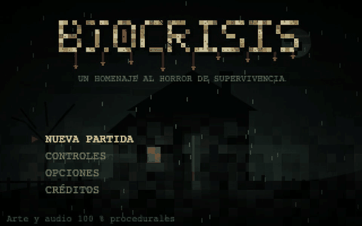
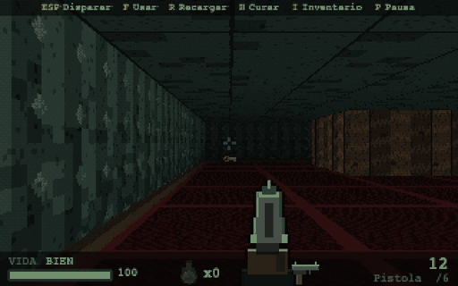
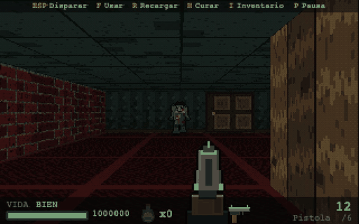
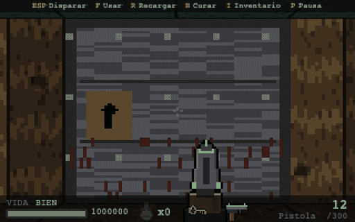
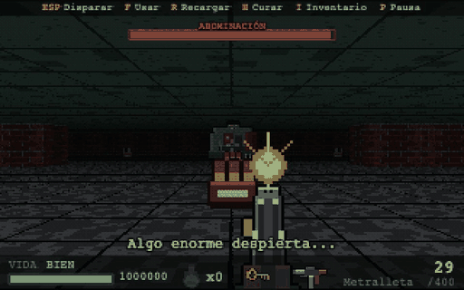

<div align="center">

# BioCrisis

**First-person survival horror, right in your browser.**
A house at night, scarce ammo, zombies that can hear you... and something huge behind the last door.

[**▶ Play online**](https://brian-cve.github.io/Biocrisis/) · [Controls](#controls-desktop) · [Run locally](#running-locally)



</div>

## What it's about

You wake up in the foyer of an abandoned house. The zombies are asleep, but not for long: every shot can be heard across the
whole floor. Find the **key** in the bedroom, return to the foyer and open the door that leads to the **boss arena**. On the
other side you'll find a submachine gun, ammo crates... and the **Abomination**. Defeat it to open the real exit.

| | |
|---|---|
|  |  |
| **Explore** a 20×20 house with doors, corridors to flee through and items to pick up. | **Pick your fights.** Slow, tough shamblers and fast, fragile runners; there isn't enough ammo for all of them. |
|  |  |
| **The foyer door** requires the key. Once opened, the boss wakes up. | **The final fight**: automatic SMG fire, cover between pillars and a boss that enrages below 50 % health. |

## Features

- **Classic raycasting** (Wolfenstein 3D / Doom style) with animated doors, z-buffered sprites, fog and dithered shading.
- **Zombies with AI**: they hear gunshots, follow your trail with A*, open doors and give up if they lose sight of you. Two
  types (shambler and runner) plus a **boss** with a health bar, an enrage phase and little reaction to stagger.
- **Three weapons**: pistol, shotgun (spread of pellets with damage falloff) and an automatic-fire submachine gun.
- **8-slot inventory** in classic survival-horror style, healing tonics and limited ammo.
- **The key wakes the house**: the level's climax; the exit is slow to open and the finale is tense.
- **Everything procedural**: textures, sprites, HUD, logo, sound effects and generative music are all created in code
  (Canvas 2D and Web Audio). There isn't a single image or sound file in the game.
- **Spatial audio**: groans, footsteps and doors are panned and attenuated by position; the music rises in intensity with danger.
- **Desktop and mobile** (landscape, with Game Boy-style touch controls) and gamepad support.
- **100 % original content**: name, characters, house, logo and typography are all our own.

**Stack:** Phaser 3.90 + Vite + TypeScript. The engine (`src/engine/`) and the logic (`src/game/`) are pure TypeScript, with no
Phaser or DOM, and are covered by tests (Vitest).

## Running locally

Requirements: Node 20+ (tested with Node 26).

```bash
npm install
npm run dev          # dev server at http://localhost:5173 (also reachable on the local network)
npm test             # unit tests (Vitest, 137 tests)
npm run build        # type-checks (tsc) and generates dist/
npm run preview      # serves dist/ at http://localhost:4173
npm run sim          # balance simulation with an automated player (see docs/BALANCE.md)
```

## How to play

**Goal:** find the key (in the farthest area: the bedroom) and open the foyer door, which is visible from the start.
**Warning:** picking up the key wakes the house, and opening that door wakes something much worse: a large room with a boss, a
submachine gun and plenty of ammo. Defeat it to open the real exit at the far end. Outside the arena there isn't enough ammo to
kill everything: pick your fights.

### Controls (desktop)
| Action | Keys |
|---|---|
| Move forward / backward | `W` `↑` / `S` `↓` |
| Turn | `A` `←` / `D` `→` (or mouse, "Mouse turning" option) |
| Strafe | `Q` / `E` |
| Fire (the SMG fires in bursts while held) | `Space` or click |
| Reload | `R` |
| Use / open door | `F` |
| Pistol / shotgun / SMG | `1` / `2` / `3` (or mouse wheel) |
| Heal (tonic) | `H` |
| Inventory | `I` or `Tab` |
| Pause | `P` |

Gamepad: left stick moves and turns (right stick also turns), A fires, B uses, X reloads, Y/RB heals, LB switches weapon,
SELECT opens the inventory, START pauses. *(Implemented, not tested with a physical gamepad.)*

### Controls (mobile, landscape)
Game Boy-style pad: **D-pad** (forward/backward/turn; supports diagonals), **A** fire, **B** reload or use
(contextual: opens the door if you're facing one), **L** switch weapon, **R** heal, **SELECT** inventory,
**START** pause. The same buttons drive the menus. In portrait a warning is shown and the game pauses.

The **CONTROLS** screen (title and pause menus) shows both schemes and is generated from the same table the game uses
(`src/game/controls.ts`), so it never goes out of date.

## Testing on a real phone (local network)

1. Put the phone and the computer on the same Wi-Fi network.
2. Run `npm run dev` (Vite listens on `0.0.0.0`). Find the computer's IP: `ipconfig getifaddr en0` (macOS) or
   `hostname -I` (Linux).
3. On the phone, open `http://<IP>:5173` in landscape and tap the screen to start (this unlocks audio).
4. If it doesn't load, check the computer's firewall (port 5173).
5. Remote debugging: Android → `chrome://inspect` over USB; iOS → Safari › Develop › your iPhone.
6. Notes: on iOS the silent switch mutes web audio; `navigator.vibrate` doesn't exist in iOS Safari (no
   vibration); there is no fullscreen mode or PWA yet.

## How performance was measured

- **Target:** 60 FPS on desktop, ≥ 30 stable FPS on a mid-range phone.
- **Method:** Chromium with mobile emulation (`isMobile`, `hasTouch`, 844×390) and `Emulation.setCPUThrottlingRate`
  (checked with a microbenchmark: ×4 → 4× slower). Worst-case scene: 6 zombies chasing, chase music, the player turning.
  Real Phaser FPS every 250 ms and per-frame cost from `step` to `postrender`.
- **Result:** 60.5–60.7 FPS average (minimum 60.3) with CPU ×1, ×4, ×6 and ×10; per-frame cost ≈ 1.3 ms (max 2.9 ms).
  Details and limitations in `docs/DECISIONS.md` (D-020, D-022). **It is not a substitute for a real device.**
- Reproduce: with `npm run dev` running, `node tools/mobile.mjs <screenshots-folder>`.

## Structure

```
src/engine/    DDA raycaster, Uint32Array renderer, procedural textures/sprites, z-buffer, overlay
src/game/      map, world, zombie AI (A*), weapons, inventory, controls (single source), settings, rank
src/audio/     Web Audio engine, SFX, spatial audio, game director; music/ = generative music
src/ui/        HUD, menus, touch pad, unified input, logo and title art
src/scenes/    Boot, Title, Controls, Options, Intro, Game, Pause, Inventory, GameOver, Win
docs/          DECISIONS.md, ASSETS.md, BALANCE.md, FLOW.md, REVIEW.md
tests/         unit tests (engine, AI, weapons, inventory, balance, music, controls, touch…)
tools/         real-browser verification scripts and balance simulation (see below)
```

## Verification tools (`tools/`)

They use Playwright (a dev dependency). The first time: `npx playwright install chromium`. With `npm run dev` running:

| Script | What it checks |
|---|---|
| `node tools/flow.mjs <dir>` | walks Boot → Title → Options → Controls → Intro → Game → Pause with screenshots |
| `node tools/cycles.mjs <dir>` | 10 cycles of starting/abandoning a game + Game Over + Victory; measures leaks |
| `node tools/musiccheck.mjs` | real music through an analyzer: levels, pulse, intensity, pause, silence, nodes |
| `node tools/audiocheck.mjs` | audio engine: voice limit, ducking, silence, cleanup |
| `node tools/mobile.mjs <dir>` | emulated mobile: real touch, multitouch, portrait, sizes, CPU ×1/×4/×6/×10 |
| `node tools/alloc.mjs`, `tools/heapprof.mjs` | allocation rate and heap profile |
| `node tools/prodcheck.mjs` | production build (with `npm run preview`): flow, no external domains or dev hooks |
| `node tools/capture-gifs.mjs <dir>` + `python3 tools/make_gifs.py <dir> docs/media` | regenerates this README's GIFs |
| `node tools/combat.mjs`, `arsenal.mjs`, `playthrough.mjs`, `tour.mjs`, `shot.mjs` | combat, weapons/inventory, enemy-free playthrough, tour and screenshots |

In development, `?scene=Game` (or any scene name) jumps straight to that scene.

## Documentation

- `docs/DECISIONS.md` — every technical decision, discarded alternatives and why (including the naming risk).
- `docs/BALANCE.md` — numbers, ammo budget, bot results and what was changed based on the measurements.
- `docs/FLOW.md` — scene state machine. `docs/ASSETS.md` — what is generated and how.
- `docs/REVIEW.md` — **an honest critical review**: what turned out weak and how to improve it.
