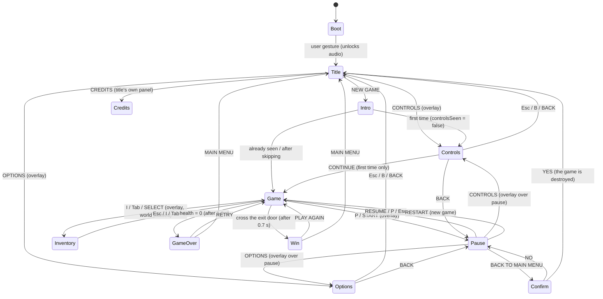

# FLOW — scene state machine

Phaser scenes: `Boot · Title · Controls · Options · Intro · Game · Pause · Inventory · GameOver · Win`.
`Controls`, `Options`, `Pause` and `Inventory` are **overlays** (the originating scene is paused and resumed when they
close, without losing state). The rest replace one another with a fade to black (`ui/transition.ts`).

## Game lifecycle
`GameScene.create()` creates all the state (World, textures, input, audio, HUD); `SHUTDOWN` releases it
(`GameScene.dispose()`): pointer/wheel listeners, ambient loop, event hooks, the `fb` texture, pointer lock.
Every exit (menu, restart, Game Over, Victory) goes through there, so games can be chained without reloading.

## Input
`ui/gameInput.ts` unifies keyboard, gamepad and touch (the H6 touch overlay only fills `GameInput.touch`) from
`game/controls.ts`. Menus use `ui/menu.ts` (keyboard, gamepad, mouse/touch with tap).
