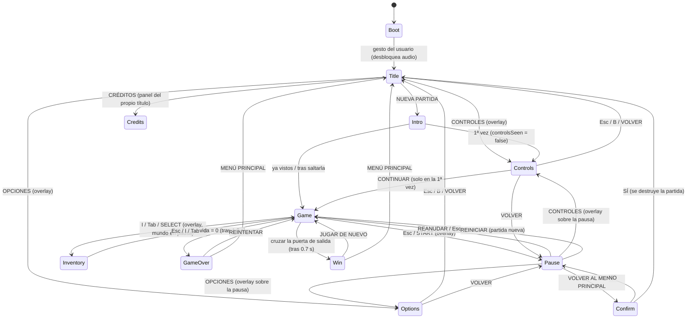

# FLOW — máquina de estados de escenas

Escenas Phaser: `Boot · Title · Controls · Options · Intro · Game · Pause · Inventory · GameOver · Win`.
`Controls`, `Options`, `Pause` e `Inventory` son **superposiciones** (la escena de origen se pausa y se reanuda al
cerrarlas, sin perder estado). El resto se sustituyen con un fundido a negro (`ui/transition.ts`).

## Ciclo de vida de una partida
`GameScene.create()` crea todo el estado (World, texturas, input, audio, HUD); `SHUTDOWN` lo libera
(`GameScene.dispose()`): listeners de puntero/rueda, bucle de ambiente, hooks de eventos, textura `fb`, pointer lock.
Cualquier salida (menú, reiniciar, Game Over, Victoria) pasa por ahí, así que se puede encadenar partidas sin recargar.

## Entrada
`ui/gameInput.ts` unifica teclado, gamepad y táctil (el overlay táctil de H6 solo rellena `GameInput.touch`) a partir de
`game/controls.ts`. Los menús usan `ui/menu.ts` (teclado, gamepad, ratón/táctil con tap).
